## Part 1. Готовый докер
Взять официальный докер образ с nginx и выкачать его при помощи docker pull

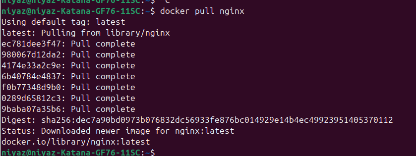

Проверить наличие докер образа через docker images

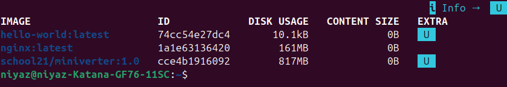

Запустить докер образ через docker run -d [image_id|repository]

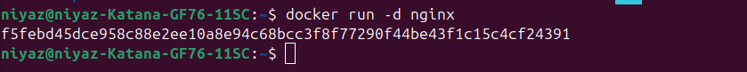

Проверить, что образ запустился через docker ps

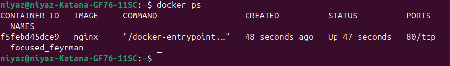

Посмотреть информацию о контейнере через docker inspect [container_id|container_name]

По выводу команды определить и поместить в отчёт размер контейнера, список замапленных портов и ip контейнера

id

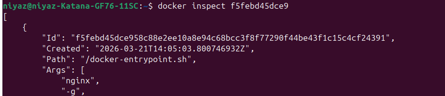

ip

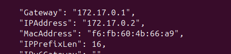

size

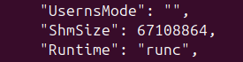

ports

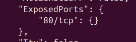

Остановить докер образ через docker stop [container_id|container_name]

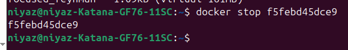

Проверить, что образ остановился через docker ps

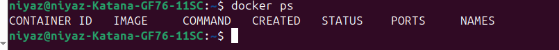

Запустить докер с портами 80 и 443 в контейнере, замапленными на такие же порты на локальной машине, через команду run

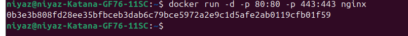

Проверить, что в браузере по адресу localhost:80 доступна стартовая страница nginx

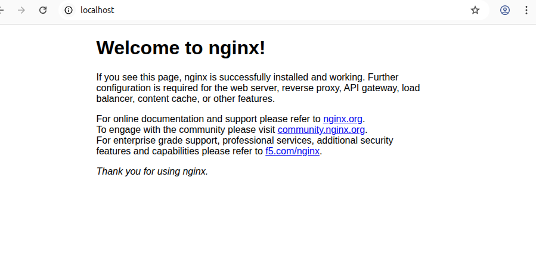

Перезапустить докер контейнер через docker restart [container_id|container_name]

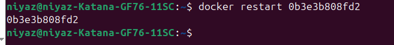

Проверить любым способом, что контейнер запустился

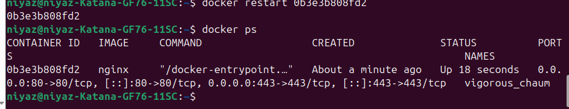

## Part 2. Операции с контейнером

Прочитать конфигурационный файл nginx.conf внутри докер контейнера через команду exec

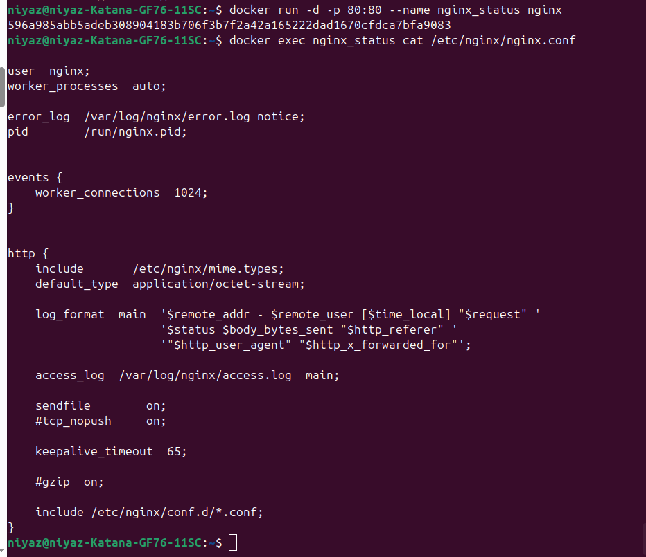

Создать на локальной машине файл nginx.conf

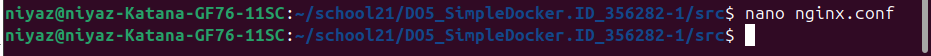

Настроить в нем по пути /status отдачу страницы статуса сервера nginx

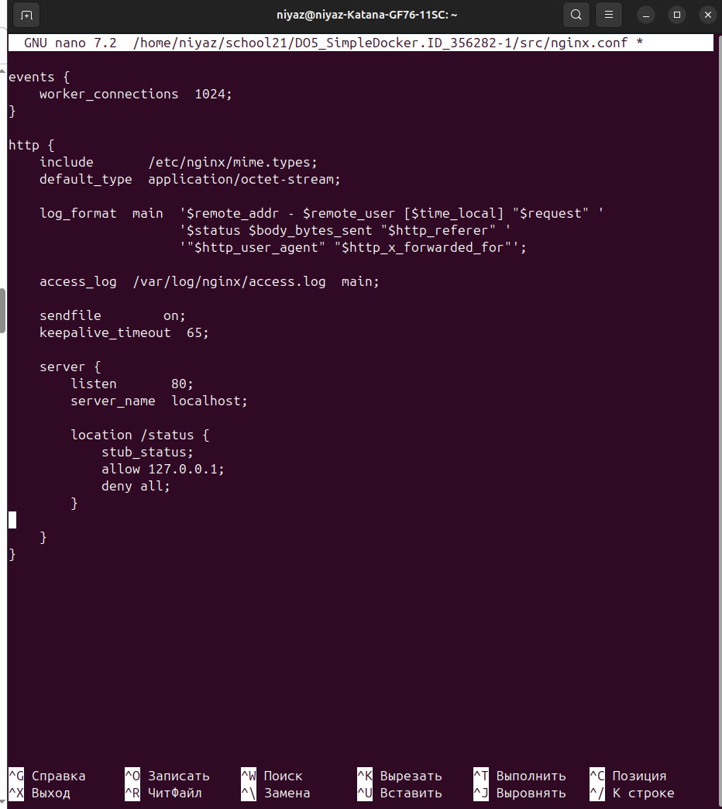

Скопировать созданный файл nginx.conf внутрь докер образа через команду docker cp

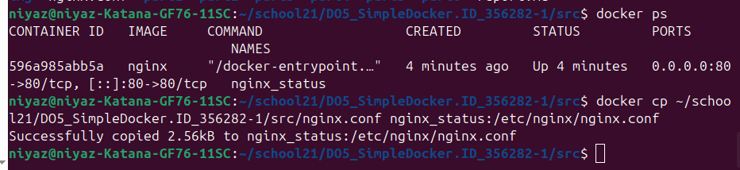

Перезапустить nginx внутри докер образа через команду exec

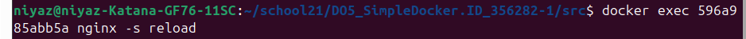

Проверить, что по адресу localhost:80/status отдается страничка со статусом сервера nginx

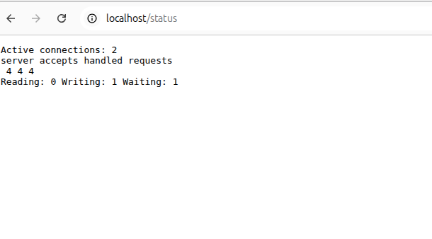

Экспортировать контейнер в файл container.tar через команду export

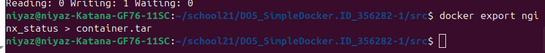

Остановить контейнер

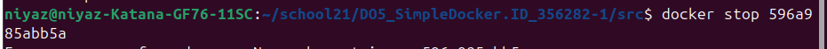

Удалить образ через docker rmi [image_id|repository], не удаляя перед этим контейнеры

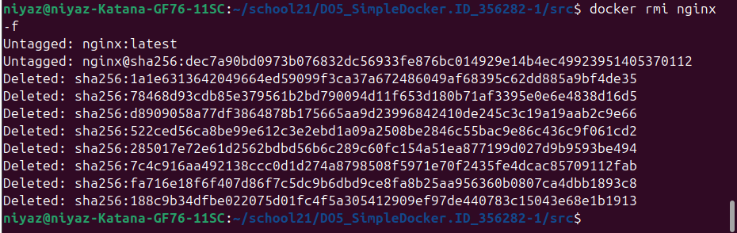

Удалить остановленный контейнер

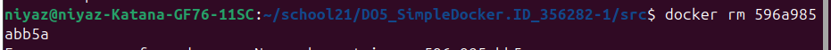

Импортировать контейнер обратно через команду import

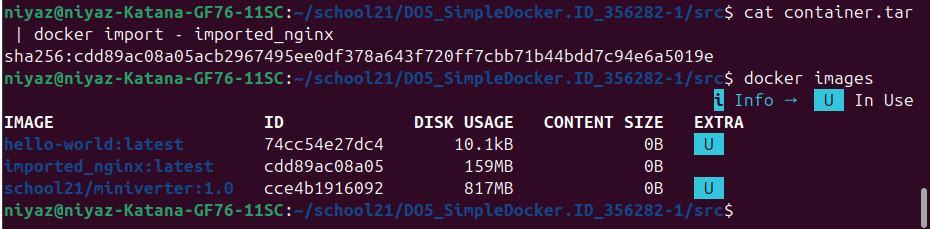

Запустить импортированный контейнер

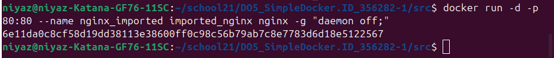

Проверить, что по адресу localhost:80/status отдается страничка со статусом сервера nginx

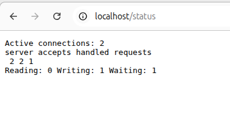

## Part 3. Мини веб-сервер

Написать мини сервер на C и FastCgi, который будет возвращать простейшую страничку с надписью Hello World!

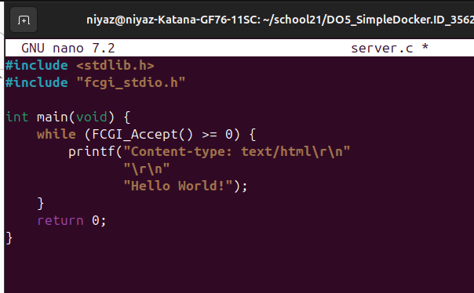

скопировал сервер в докер через команду docker cp

перешел в интерактивный режим(внутрь своего контейнера)

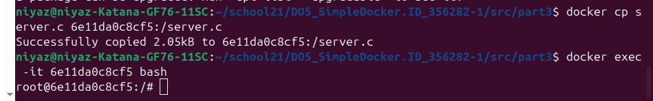

скачал нужные библиотки:
apt update

apt-get install libfcgi-dev

apt-get install spawn-fcgi

apt-get install gcc

запуск

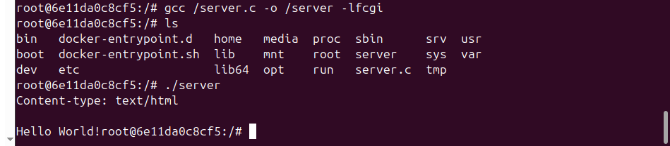

Запустить написанный мини сервер через spawn-fcgi на порту 8080

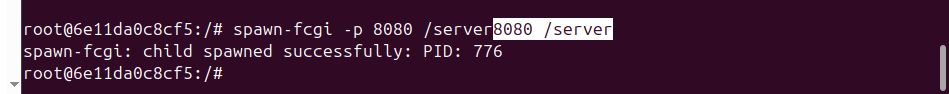

Написать свой nginx.conf, который будет проксировать все запросы с 81 порта на 127.0.0.1:8080

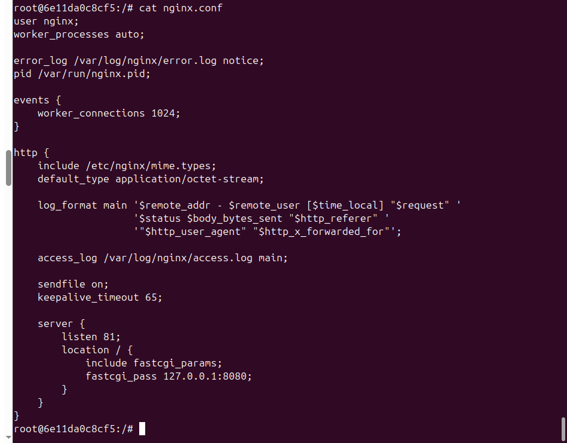

cкачал nginx

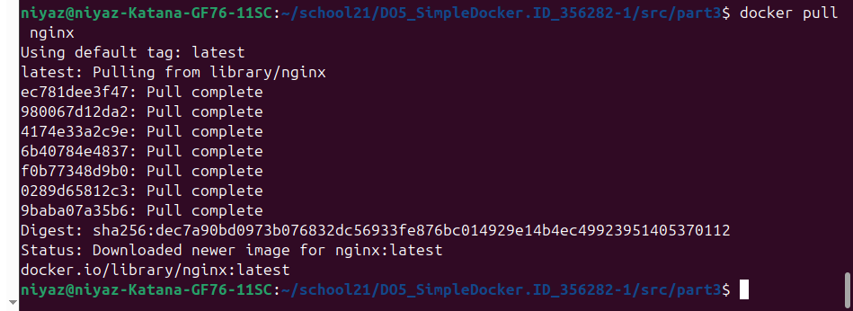

запустил nginx

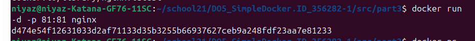

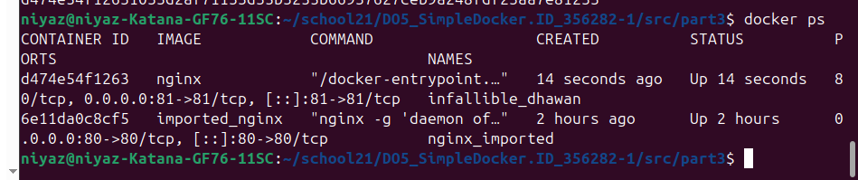

скопировал туда файлы server.c и nginx.conf

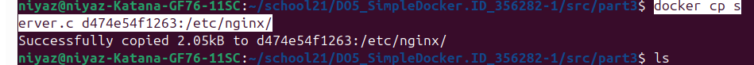

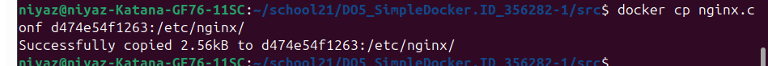

запутил server.c

запустила через spawn-fcgi

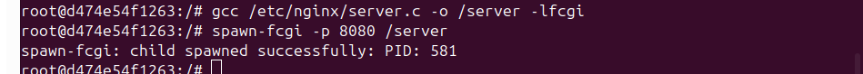

перезапустил

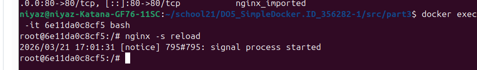

Проверить, что в браузере по localhost:81 отдается написанная вами страничка

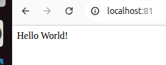

В терминале

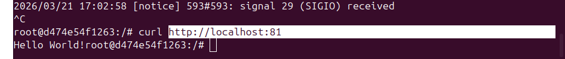

## Part 4. Свой докер

При написании докер образа избегайте множественных вызовов команд RUN

Написать свой докер образ, который:

1) собирает исходники мини сервера на FastCgi из Части 3

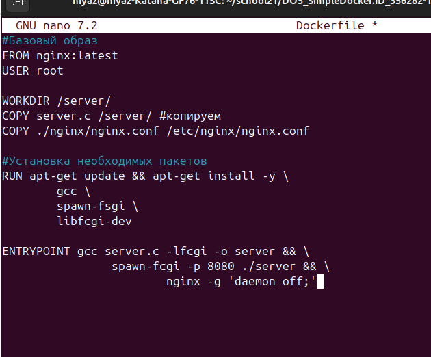

2) запускает его на 8080 порту

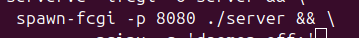

3) копирует внутрь образа написанный ./nginx/nginx.conf

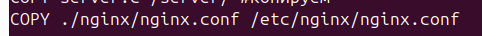

4) запускает nginx.
nginx можно установить внутрь докера самостоятельно, а можно воспользоваться готовым образом с nginx'ом, как базовым.

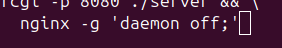

Собрать написанный докер образ через docker build при этом указав имя и тег

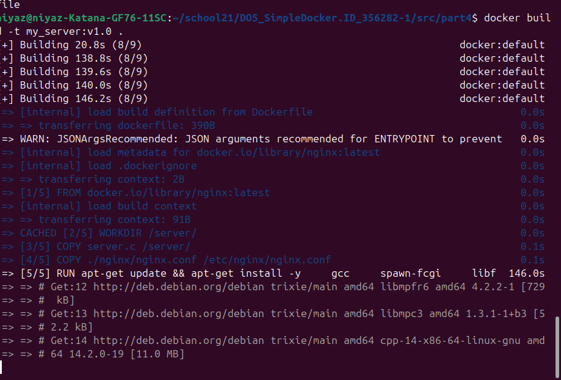

Проверить через docker images, что все собралось корректно

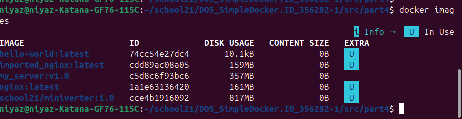

Запустить собранный докер образ с маппингом 81 порта на 80 на локальной машине и маппингом папки ./nginx внутрь контейнера по адресу, где лежат конфигурационные файлы nginx'а (см. Часть 2)

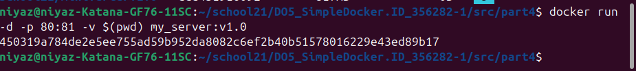
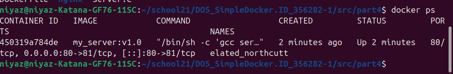

Проверить, что по localhost:80 доступна страничка написанного мини сервера

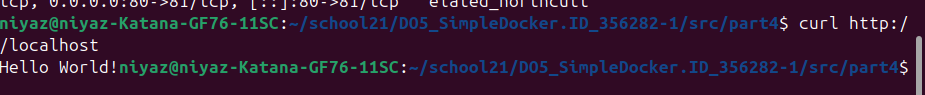

Дописать в ./nginx/nginx.conf проксирование странички /status, по которой надо отдавать статус сервера nginx

Перезапустить докер образ
Если всё сделано верно, то, после сохранения файла и перезапуска контейнера, конфигурационный файл внутри докер образа должен обновиться самостоятельно без лишних действий

Проверить, что теперь по localhost:80/status отдается страничка со статусом nginx

## Part 5. Dockle

После написания образа никогда не будет лишним проверить его на безопасность.
== Задание ==

Просканировать образ из предыдущего задания через dockle [image_id|repository]

Исправить образ так, чтобы при проверке через dockle не было ошибок и предупреждений

"CIS-DI-0001: Create a user for the container" В конце Dockerfile добавить переключение на не-root пользователя:

Для исправления ошибки:
"CIS-DI-0006: Add HEALTHCHECK instruction" Можно добавить проверку здоровья:

HEALTHCHECK --interval=30s --timeout=3s --start-period=5s --retries=3 \
  CMD curl -f http://localhost/ || exit 1
dockerfile
"CIS-DI-0005: Enable Content trust for Docker" перед тем как собрать докер, использую эту команду "export DOCKER_CONTENT_TRUST=1"

"CIS-DI-0010: Do not store credential in environment variables/files"-команда dockle -ak NGINX_GPGKEY -ak NGINX_GPGKEY_PATH lll:2.0

"CIS-DI-0008: Confirm safety of setuid/setgid files" Это предупреждение из базового образа nginx (файлы, которые требуют повышенных привилегий). Это нормально для nginx, можно игнорировать.

готовый dockerfile

## Part 6. Базовый Docker Compose

Вот вы и закончили вашу разминку. А хотя погодите...
Почему бы не поэкспериментировать с развёртыванием проекта, состоящего сразу из нескольких докер образов?
== Задание ==

Написать файл docker-compose.yml, с помощью которого:

1) Поднять докер контейнер из Части 5 (он должен работать в локальной сети, т.е. не нужно использовать инструкцию EXPOSE и мапить порты на локальную машину)

2) Поднять докер контейнер с nginx, который будет проксировать все запросы с 8080 порта на 81 порт первого контейнера

Замапить 8080 порт второго контейнера на 80 порт локальной машины

Остановить все запущенные контейнеры

Собрать и запустить проект с помощью команд docker-compose build и docker-compose up

Проверить, что в браузере по localhost:80 отдается написанная вами страничка, как и ранее

